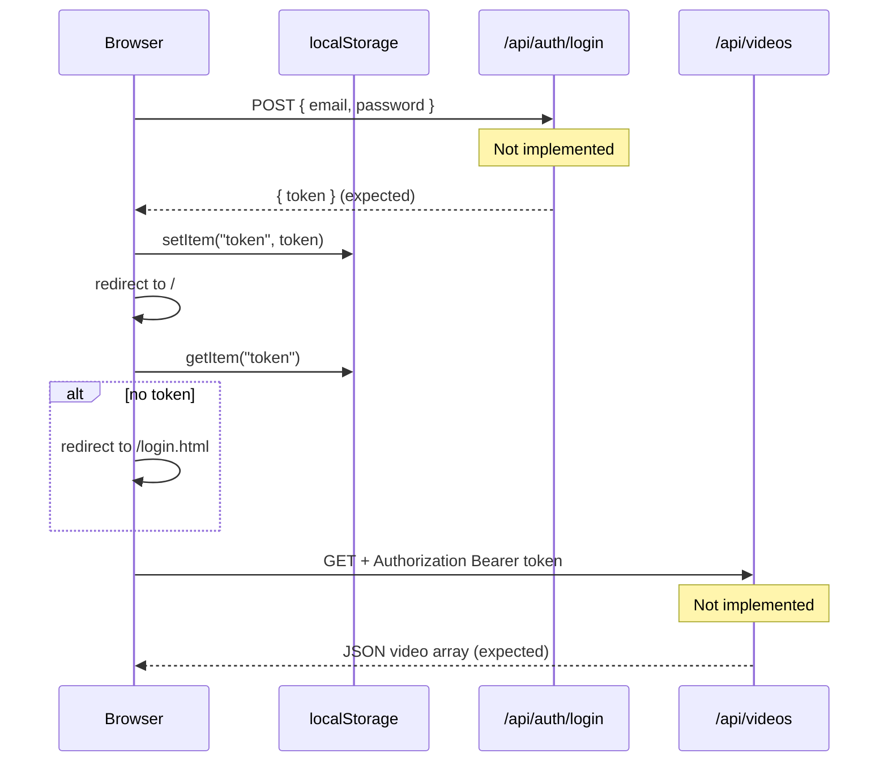

# STREAMFLIX — Frontend Discovery Audit

**Generated:** 2026-06-08  
**Scope:** Repo reality check before Phase 2 (premium frontend redesign)  
**Stack confirmed:** Spring Boot 4.0.6 + Thymeleaf + static CSS/JS (`src/main/resources/`)

---

## Executive Summary

The repository is in an **early scaffold state**. Controllers, services, models, DTOs, repositories, and design-pattern classes exist as **empty Java shells** with no Spring annotations, no JPA mappings, and no REST mappings. The frontend consists of **two partial HTML templates** (`main.html`, `login.html`) that call API endpoints **which do not exist yet**. Seven additional pages listed in the project brief are **not present** in the repo.

JWT auth is **assumed by the frontend** (`localStorage`) but **not implemented** on the backend (no `SecurityConfig`, no JWT library in root `pom.xml`, no token provider).

A parallel **`streaming-app/`** multi-module design (documented in `streaming-app/ARCHITECTURE.md`) describes the intended full architecture but is **not wired** into the root Maven build.

---

## 1. Controller Endpoints

### 1.1 Implemented endpoints (runtime)

| Method | Path | Controller | Status |
|--------|------|------------|--------|
| — | — | — | **None.** No `@RestController`, `@Controller`, or mapping annotations exist anywhere under `src/main/java/`. |

Spring Boot will only serve static resources and default error handling until controllers are implemented.

---

### 1.2 Endpoints referenced by existing frontend (must be implemented)

#### Auth — `AuthController` (stub)

| Method | Path | Request body | Expected response | Referenced by |
|--------|------|--------------|-------------------|---------------|
| `POST` | `/api/auth/login` | `{ "email": string, "password": string }` | `{ "token": string, ... }` | `login.html` |

On success, `login.html` stores `data.token` in `localStorage` under key `token` and redirects to `/`.

#### Videos — `VideoController` (stub)

| Method | Path | Headers | Expected response | Referenced by |
|--------|------|---------|-------------------|---------------|
| `GET` | `/api/videos` | `Authorization: Bearer <token>` | JSON array of video objects | `main.html` |

Fields consumed by `main.html`:

```json
[
  {
    "videoId": "number",
    "title": "string",
    "thumbnailUrl": "string"
  }
]
```

`main.html` navigates to `/video-details.html?id=${v.videoId}` on card click (note: **plural** `video-details`, while brief lists `video-detail.html`).

---

### 1.3 Scaffolded controllers — intended endpoints (not implemented)

Derived from controller class names, project brief (§2.2), `schema.sql`, DTO names, and `streaming-app/ARCHITECTURE.md`.

#### `AuthController`

| Method | Path | Request | Response (inferred) | Notes |
|--------|------|---------|---------------------|-------|
| `POST` | `/api/auth/login` | `LoginRequest`: `{ email, password }` | `{ token, user? }` | Frontend already calls this |
| `POST` | `/api/auth/register` | `{ name, email, password }` | `{ token }` or `201` + user | Needed for `register.html` |
| `POST` | `/api/auth/forgot-password` | `{ email }` | `{ message }` | Scaffolded in brief |
| `POST` | `/api/auth/reset-password` | `{ token, newPassword }` | `{ message }` | Scaffolded in brief |

#### `VideoController`

| Method | Path | Request / params | Response (inferred) | Notes |
|--------|------|------------------|---------------------|-------|
| `GET` | `/api/videos` | `Authorization` header | `VideoDto[]` | List catalog |
| `GET` | `/api/videos/{id}` | path `id` | `VideoDto` | Video detail page |
| `GET` | `/api/videos/{id}/stream` | `?quality=SD\|HD\|FULL_HD\|ULTRA_HD` | stream URL or binary | Bridge pattern (`SDqaulity`, `HDQuality`, `FullHDQuality`, `UltraHdQuality`) |
| `GET` | `/api/videos/categories` | — | composite tree | Composite pattern (`categorycomposite`, `videoleaf`) |

**Inferred `VideoDto` shape** (from `schema.sql` + seed data):

```json
{
  "videoId": 1,
  "title": "string",
  "description": "string",
  "genre": "ACTION | COMEDY | HORROR | DRAMA | SCI_FI | DOCUMENTARY | ENTERTAINMENT",
  "durationSeconds": 8160,
  "releaseYear": 1999,
  "rating": 8.7,
  "ageRating": "G | PG | PG13 | R | NC17",
  "thumbnailUrl": "/assets/thumbnails/matrix.jpg",
  "videoUrl": "/videos/matrix.mp4",
  "type": "MOVIE | TV_SHOW | DOCUMENTARY",
  "isPremium": true
}
```

#### `WatchlistController`

| Method | Path | Request | Response (inferred) | Notes |
|--------|------|---------|---------------------|-------|
| `GET` | `/api/watchlist` | `Authorization` | `VideoDto[]` or watchlist entries | `watchlist.html` |
| `POST` | `/api/watchlist/{videoId}` | — | `201` | Command: `Addtowatchlistcommand` |
| `DELETE` | `/api/watchlist/{videoId}` | — | `204` | Command: `Removefromwatchlistcommand` |

#### `SubscriptionController`

| Method | Path | Request | Response (inferred) | Notes |
|--------|------|---------|---------------------|-------|
| `GET` | `/api/subscriptions/plans` | — | plan catalog | `subscription.html` |
| `GET` | `/api/subscriptions/me` | `Authorization` | `SubscriptionDTO` | Current user plan |
| `POST` | `/api/subscriptions` | `{ plan: "BASIC" \| "STANDARD" \| "PREMIUM" }` | `SubscriptionDTO` | Subscribe |
| `DELETE` | `/api/subscriptions/me` | `Authorization` | `204` | Cancel |

**Inferred `SubscriptionDTO`:**

```json
{
  "subscriptionId": 1,
  "userId": 2,
  "plan": "BASIC | STANDARD | PREMIUM",
  "startDate": "2026-06-08",
  "endDate": "2026-07-08",
  "status": "ACTIVE | CANCELLED | EXPIRED"
}
```

#### Payment (no `PaymentController` in root project; planned in `streaming-app`)

| Method | Path | Request | Response (inferred) | Notes |
|--------|------|---------|---------------------|-------|
| `POST` | `/api/payments` | `PaymentDTO` | payment result | `PaymentService`, adapters |
| `GET` | `/api/payments/history` | `Authorization` | `PaymentDTO[]` | Billing history |

**Inferred `PaymentDTO`:**

```json
{
  "paymentId": 1,
  "userId": 2,
  "amount": 9.99,
  "currency": "USD",
  "paymentMethod": "PAYPAL | STRIPE",
  "gatewayTxnId": "string",
  "paymentDate": "2026-06-08T12:00:00Z",
  "status": "SUCCESS | FAILED | REFUNDED"
}
```

Adapters: `stripeadapter`, `paypaladapter` implement `paymentgateway`.

#### `AdminController`

| Method | Path | Request | Response (inferred) | Notes |
|--------|------|---------|---------------------|-------|
| `GET` | `/api/admin/analytics` | `Authorization` (ADMIN role) | aggregates | `admin.html` |
| `GET` | `/api/admin/users` | — | `UserDTO[]` | User management |
| `POST` | `/api/admin/videos` | `VideoDto` | created video | Content management |
| `PUT` | `/api/admin/videos/{id}` | `VideoDto` | updated video | Content management |
| `DELETE` | `/api/admin/videos/{id}` | — | `204` | Content management |

**Inferred `UserDTO`:**

```json
{
  "userId": 1,
  "name": "string",
  "email": "string",
  "profileImageUrl": "string | null",
  "role": "USER | ADMIN"
}
```

#### User profile (no `UserController` in root; planned in `streaming-app`)

| Method | Path | Request | Response | Notes |
|--------|------|---------|----------|-------|
| `GET` | `/api/users/me` | `Authorization` | `UserDTO` | `profile.html` / `profle.html` |
| `PUT` | `/api/users/me` | partial profile | `UserDTO` | Profile update |

#### Watch history (model exists; no controller)

| Method | Path | Response | Notes |
|--------|------|----------|-------|
| `GET` | `/api/history` | `WatchHistory[]` | Resume / continue watching |
| `PUT` | `/api/history/{videoId}` | `{ progressSeconds, completed }` | Progress sync |

#### Player commands (pattern layer; no REST exposure yet)

| Behavior | Pattern class | Suggested API |
|----------|---------------|---------------|
| Play | `playvideocommand` | `POST /api/player/play` |
| Pause | `pausevideocommand` | `POST /api/player/pause` |
| Invoker | `Useractioninvoker` | orchestrates command execution |

#### Access chain (pattern layer)

Chain order per brief: **auth → subscription → age → streaming access**

| Handler class | Responsibility |
|---------------|----------------|
| `Requesthandler` | Base chain |
| `SubscriptionValidationHandler` | Active subscription check |
| `AgeRestrictionHandler` | Age rating vs user |
| `StreamingAccessHandler` | Final stream authorization |

These should gate `GET /api/videos/{id}/stream` (and related playback endpoints).

---

### 1.4 DTO / model implementation status

All of the following are **empty classes** (no fields, no Lombok, no JPA):

| Class | Package | Purpose |
|-------|---------|---------|
| `LoginRequest` | `dto` | Login payload |
| `UserDTO` | `dto` | User projection |
| `VideoDto` | `dto` | Video projection |
| `SubscriptionDTO` | `dto` | Subscription projection |
| `PaymentDTO` | `dto` | Payment projection |
| `User` | `model` | User entity |
| `videoentity` | `model` | Video entity |
| `watchlist` | `model` | Watchlist entity |
| `WatchHistory` | `model` | Watch history entity |
| `subscription` | `model` | Subscription entity |
| `payment` | `model` | Payment entity |

Repositories (`UserRepository`, `VideoRepository`, etc.) are also empty — **not** `JpaRepository` interfaces.

---

## 2. Template → Route Mapping

### 2.1 Current files on disk

| File | Location | Size / state | Served as |
|------|----------|--------------|-----------|
| `main.html` | `src/main/resources/templates/` | Netflix-style landing | **Not routable** without a `@Controller` returning `"main"` |
| `login.html` | `src/main/resources/templates/` | Minimal login form | **Not routable** without controller |
| `style.css` | `src/main/resources/static/style.css` | ~2.5 KB Netflix theme | `/style.css` (not `/css/style.css`) |
| `main.js` | — | **Missing** | Referenced as `/js/main.js` in `main.html` |

Templates reference **static-style URLs** (`.html` suffix) rather than Thymeleaf controller routes.

### 2.2 URLs used in existing HTML

| URL in template | Target page (brief) | File exists? | Backend route exists? |
|-----------------|---------------------|--------------|----------------------|
| `/` | Home / catalog | `main.html` (templates only) | No |
| `/login.html` | Login | `login.html` (templates only) | No |
| `/register.html` | Register | **No** | No |
| `/watchlist.html` | Watchlist | **No** | No |
| `/profile.html` | Profile | **No** (`profle.html` typo in brief) | No |
| `/subscription.html` | Subscription | **No** | No |
| `/video-details.html?id=` | Video detail | **No** (`video-detail.html` in brief) | No |

### 2.3 Recommended mapping (Phase 2 target)

Two valid approaches — pick one and apply consistently:

**Option A — Thymeleaf MVC (matches `spring-boot-starter-thymeleaf`)**

| HTTP | Controller route | Template | Page |
|------|------------------|----------|------|
| `GET` | `/` | `main.html` | Catalog / home |
| `GET` | `/login` | `login.html` | Sign in |
| `GET` | `/register` | `register.html` | Sign up |
| `GET` | `/watchlist` | `watchlist.html` | Watchlist |
| `GET` | `/profile` | `profile.html` | Profile (fix `profle.html` typo) |
| `GET` | `/subscription` | `subscription.html` | Plans & billing |
| `GET` | `/videos/{id}` | `video-detail.html` | Video detail + player |
| `GET` | `/admin` | `admin.html` | Admin dashboard |

**Option B — Static HTML under `static/`** (as `ARCHITECTURE.md` shows under `static/html/`)

Same paths but files live in `static/html/*.html` and are served without a view controller.

**Current mismatch:** Templates live in `templates/` but links use `.html` static paths; CSS links use `/css/style.css` while the file is at `/style.css`.

### 2.4 Static assets (planned)

| Asset | Expected path | Status |
|-------|---------------|--------|
| Design system CSS | `/css/style.css` or `/css/main.css` | Wrong path; file at `/style.css` |
| API client + UI | `/js/main.js` | Missing |
| Thumbnails / video | `/assets/thumbnails/*`, `/videos/*` | Referenced in `seed-data.sql`; files not in repo |

### 2.5 Pages required by project brief (§2.3 / §6)

| Template | Action required |
|----------|-----------------|
| `main.html` | Rebuild |
| `login.html` | Rebuild |
| `register.html` | Build |
| `admin.html` | Build |
| `profile.html` | Build (resolve `profle.html` typo) |
| `subscription.html` | Build |
| `video-detail.html` | Build (resolve `video-details.html` link in `main.html`) |
| `watchlist.html` | Build |
| `style.css` | Replace/extend with monochrome design system |
| `main.js` | Build API client |

Additional pages implied by scaffolded backend (not in §2.3 table):

- Forgot password / reset password (from `AuthController` brief)
- Possibly a dedicated player view (patterns: play/pause commands, quality bridge)

---

## 3. Gap List — Backend Features With No UI

| Backend capability (scaffolded or documented) | UI coverage |
|-----------------------------------------------|-------------|
| `AuthController` — register | No `register.html` |
| `AuthController` — forgot / reset password | No templates |
| `VideoController` — single video metadata | No `video-detail.html` |
| `VideoController` — streaming / quality selection | No player UI, no quality picker |
| `WatchlistController` — list / add / remove | No `watchlist.html` |
| `SubscriptionController` — plans, subscribe, cancel | No `subscription.html` |
| `PaymentService` + Stripe/PayPal adapters | No checkout or payment method UI |
| `AdminController` — analytics | No `admin.html` |
| `AdminController` — content CRUD | No admin content forms |
| `UserService` / profile | No `profile.html` |
| `WatchHistory` model | No continue-watching UI |
| Chain of responsibility (auth → sub → age → stream) | No error states in UI for denied access |
| Command pattern (play/pause) | No player controls wired to API |
| Composite catalog tree | Home page uses flat grid only |
| `vw_active_subscribers` view | No admin subscriber widget |
| `sp_expire_subscriptions` procedure | No admin tooling trigger |
| Seed data / DB (`streaming-app/schema.sql`) | No migration or UI connection in root app |
| `streaming-app` multi-module architecture | Not integrated; separate from runnable root project |

---

## 4. Gap List — UI Elements With No Backend Connection

| UI element | Location | Issue |
|------------|----------|-------|
| Login form submit | `login.html` | Calls `POST /api/auth/login` — **endpoint does not exist** |
| JWT gate + redirect | `main.html` | Checks `localStorage.token`; no backend issues or validates tokens |
| Video catalog fetch | `main.html` | Calls `GET /api/videos` — **endpoint does not exist** |
| Video card navigation | `main.html` | Links to `/video-details.html` — **page does not exist** |
| Nav: Watchlist | `main.html` | Links to `/watchlist.html` — **page does not exist** |
| Nav: Profile | `main.html` | Links to `/profile.html` — **page does not exist** |
| Subscribe CTA | `main.html` | Links to `/subscription.html` — **page does not exist** |
| Register link | `login.html` | Links to `/register.html` — **page does not exist** |
| `main.js` script include | `main.html` | **File missing** |
| Stylesheet | both templates | `href="/css/style.css"` — **file is at `/style.css`** |
| Thumbnail / video URLs | seed data paths | Static media files not present under `static/` |
| Home page auth redirect | `main.html` | Redirects to `/login.html` — not served by Thymeleaf without routing fix |

---

## 5. Auth Flow

### 5.1 What the frontend does today



### 5.2 Backend auth status

| Concern | Status |
|---------|--------|
| `spring-boot-starter-security` | In `pom.xml` — **no `SecurityConfig` class** |
| JWT library (`jjwt`) | In `streaming-app/pom.xml` only — **not in root `pom.xml`** |
| `JwtTokenProvider` / `JwtAuthFilter` | Documented in `ARCHITECTURE.md` — **not present in root `src/`** |
| `UserService` | Empty stub |
| `AuthController` | Empty stub |
| `LoginRequest` DTO | Empty stub |
| Password hashing (BCrypt) | Implied by `seed-data.sql` comments — **not implemented in Java** |
| Role-based access (`USER`, `ADMIN`) | In DB schema — **not enforced in code** |

### 5.3 JWT in localStorage — confirmation

**Frontend assumption:** CONFIRMED. Both `login.html` (writes) and `main.html` (reads) use `localStorage` key `token` with `Authorization: Bearer <token>` on API calls.

**Backend confirmation:** **NOT IMPLEMENTED.** There is no JWT issuance, validation filter, or CORS/security rules. The frontend auth flow is **aspirational** until `AuthController`, security config, and JWT provider are built.

### 5.4 Recommended auth contract (for Phase 2 wiring)

**Login**

```
POST /api/auth/login
Content-Type: application/json

{ "email": "alice@example.com", "password": "alice123" }

→ 200 OK
{ "token": "<jwt>", "user": { "userId", "name", "email", "role" } }

→ 401 Unauthorized
{ "error": "Invalid credentials" }
```

**Authenticated requests**

```
Authorization: Bearer <jwt>
```

**Token storage:** Continue `localStorage` per existing templates, or migrate to `httpOnly` cookie if security hardening is required (would be a deliberate change from current code).

**Protected routes:** All `/api/*` except `/api/auth/login`, `/api/auth/register`, and public plan listing should require valid JWT.

**Admin routes:** Require `role === "ADMIN"` from JWT claims or `UserDTO`.

---

## 6. Design-Pattern → UI Mapping (for integration)

| Pattern | Classes | Suggested UI touchpoint |
|---------|---------|-------------------------|
| Adapter | `stripeadapter`, `paypaladapter`, `paymentgateway` | Payment method selection on `subscription.html` |
| Bridge | `SDqaulity`, `HDQuality`, `FullHDQuality`, `UltraHdQuality`, `streamingservice` | Quality selector on video player |
| Chain | `SubscriptionValidationHandler`, `AgeRestrictionHandler`, `StreamingAccessHandler` | Error modals when stream denied (expired sub, age block) |
| Command | `Addtowatchlistcommand`, `Removefromwatchlistcommand`, `playvideocommand`, `pausevideocommand` | Watchlist buttons, player controls |
| Composite | `categorycomposite`, `videoleaf`, `contentcomponent` | Category-grouped catalog on home |
| Builder | `VideoBuilder`, `Video` | Admin video creation form |
| Singleton | `ConfigurationManger`, `DatabaseconnectionManger` | Server-side only (no direct UI) |

---

## 7. Infrastructure & Build Notes

| Item | Detail |
|------|--------|
| Root app entry | `SdaprojApplication.java` |
| Duplicate/unused | `VstramAppliccation.java` (empty, typo) |
| `application.properties` | Only `spring.application.name=sdaproj` — no DB URL, no JWT secret |
| Database schema | `streaming-app/schema.sql` + `seed-data.sql` (not applied by root app) |
| Java version | 25 (root `pom.xml`) vs Java 17 in `ARCHITECTURE.md` |
| Thymeleaf usage | Templates are plain HTML — no `th:*` attributes, no layout fragments |
| Tests | `SdaprojApplicationTests.java` only — context load |

---

## 8. Phase 2 Prerequisites (ordered)

1. **Resolve routing strategy** — Thymeleaf MVC vs static HTML; fix CSS/JS paths.
2. **Implement REST API** — At minimum: auth login, videos list/detail, watchlist, subscription, payments, admin.
3. **Add security + JWT** — Match frontend `Bearer` + `localStorage` contract.
4. **Wire JPA entities** to `schema.sql` tables and seed data.
5. **Create missing templates** and shared layout (nav, footer, design tokens).
6. **Build `main.js`** — Central API client with auth header injection and error handling.
7. **Add static media** or placeholder asset strategy for thumbnails/video paths from seed data.
8. **Normalize naming** — `video-detail` vs `video-details`, `profile` vs `profle`.

---

## 9. File Inventory Quick Reference

```
src/main/resources/
├── application.properties          # minimal config
├── templates/
│   ├── main.html                   # partial home (needs rebuild)
│   └── login.html                  # partial login (needs rebuild)
└── static/
    └── style.css                   # Netflix theme (wrong path in HTML)

src/main/java/.../controller/       # 5 empty controllers
src/main/java/.../service/          # 4 empty services
src/main/java/.../model/            # 6 empty models
src/main/java/.../dto/              # 5 empty DTOs
src/main/java/.../repository/       # 6 empty repositories
src/main/java/.../Patterns/         # 25 empty pattern classes
src/main/java/.../config/           # 2 empty config classes

streaming-app/                      # planned multi-module (not in root build)
├── ARCHITECTURE.md
├── schema.sql
└── seed-data.sql
```

---

*End of audit. Phase 2 may proceed with frontend redesign once backend endpoints and routing decisions are aligned with this document.*
